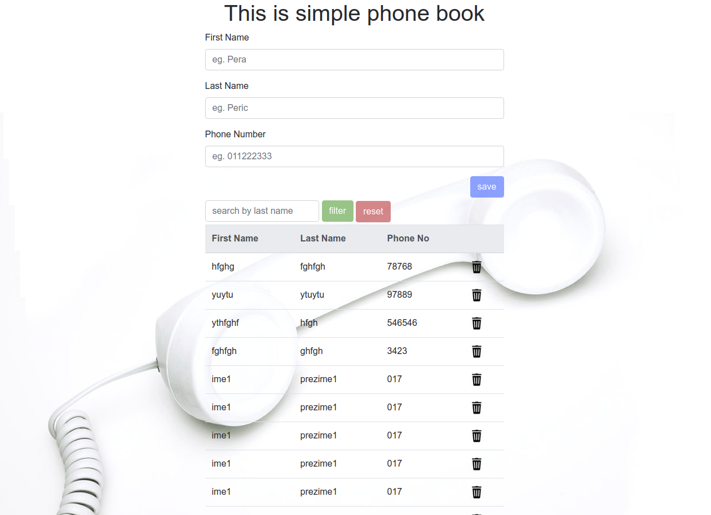

# Phone book
This is simple phone book. Angular 5 - client, Node.js - server, MySql - database

## Dependencies
[Node.js](https://nodejs.org/en/), [MySql](https://www.mysql.com/)

## Install
- *position to server folder*
- **npm install**

## How to start
- *position to server folder*
- *You need to check **MySql** connection details (check **user** and **password**), in file [start.js](https://github.com/npilipovic86/phone-book/blob/master/server/start.js#L6) **line 6-7**, and file [server.js](https://github.com/npilipovic86/phone-book/blob/master/server/server.js#L16)* **line 16-17**
- *For first start type* **node start**, *this will create the database and table*, *next time use* **npm start**

## How it look like

